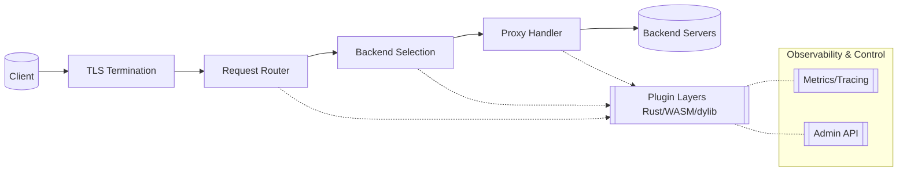

# Jester — Master Design Document

> Status: Draft • Scope: Jester reverse proxy & plugin ecosystem • Audience: contributors, reviewers, integrators

## 1. Vision & Goals
- **Programmable edge runtime**: High-performance reverse proxy with a progressive plugin story, from in-proc Rust to sandboxed WASM.
- **Secure-by-default**: TLS first, least-privilege extensions, reproducible builds, and predictable hot reloads.
- **Accessible configuration**: Simple 10-line getting-started file that scales to large, DRY, schema-validated deployments.
- **Observable & operable**: First-class metrics, tracing, and admin controls for debugging and automation.
- **Incremental roadmap**: Deliver value early (basic TLS proxy) while paving the way for advanced features (QUIC, policy engine, distributed config).

### Non-Goals (for now)
- Full service mesh control plane.
- Proprietary plugin formats (open-first with WIT + trait-based APIs).
- Deep GUI tooling (CLI-centric, can integrate later).

## 2. High-Level Architecture



Key principles:
1. **Tower everywhere**: Request processing is a composition of `Layer`/`Service` stacks to keep data zero-copy and ergonomic.
2. **Pluggable edges**: Listener, router, filters, upstream selection, response transforms, and observability all share the same extension contracts.
3. **Runtime isolation**: Choose between in-process performance (Tier A), WASI safety (Tier B), or explicitly-allowed native dylibs (Tier C).

## 3. Core Components

| Component | Responsibilities | Notes |
| --- | --- | --- |
| Connection Handler | TLS acceptor, ALPN, connection pooling, protocol detection (HTTP/1.1, h2, future h3/quic) | Uses rustls initially; h3 via `quinn` behind feature flag |
| Router | Host/path/header/method matching to `Route` definitions | Strategy/chain-of-responsibility patterns allow custom routers |
| Backend Manager | Upstream pools, active/passive health checks, circuit breakers, retries, service discovery adapters | Integrates with plugin load balancers |
| Middleware Pipeline | Request & response filters (auth, transforms, caching, compression, WAF) | Ordered chains, same trait surface regardless of implementation tier |
| Observability Layer | Metrics, logs, traces, tap/diag tooling, admin API for stats/config | Built on `tracing`, `metrics`/Prometheus, OpenTelemetry |
| Configuration System | Typed TOML + JSON Schema, env interpolation, file includes, hot reload | CLI tools: `jester config validate/lint/schema` |

## 4. Plugin & Extension Architecture

### Tiered Execution Model

| Tier | Implementation | Use cases | Safety posture |
| --- | --- | --- | --- |
| **Tier A** | In-process Rust layers (Tower `Layer`/`Service`) | First-party routing, retries, caching, metrics | Highest perf, controlled by Cargo features or registry |
| **Tier B** | WASI plugins (wasmtime) via WIT-defined ABI | Community filters, custom auth, transforms, policy | Capability-scoped, hot-swappable per route |
| **Tier C** | ABI-stable dynamic libraries (`.so`/`.dylib`) | Trusted native code needing separate builds | Off by default; requires `--allow-unsafe-dylib` |

All tiers implement the canonical trait surface:

```rust
pub trait JesterPlugin: Send + Sync + 'static {
    fn name(&self) -> &'static str;
    fn version(&self) -> semver::Version;
    fn layer(&self, cfg: serde_json::Value) -> anyhow::Result<tower::Layer<JesterSvc>>;
    fn capabilities(&self) -> &'static [&'static str];
}
```

For WASI, the WIT sketch defines request/response records and synchronous hooks (e.g., `http-filter`). Hosts grant minimal time/random/I/O access only when declared.

### Extension Points
- Listener providers (TCP/TLS), ALPN negotiators.
- Routers and matchers.
- Request filters (auth, header/body mutate, rate limiting).
- Upstream selection and LB strategies.
- Response filters (compression, cache, HTML injection, WAF).
- Observability exporters (metrics, logs, traces).
- Storage adapters (caches, KV for rate limits).
- Control plane hooks (hot reload events, health reporting).

### Lifecycle
1. **Registration**: On boot, scan `plugins/` + manifests (`.json`) describing metadata, capabilities, config schema, and optional resources.
2. **Validation**: Config validated against schema before activation; host enforces capability bounds.
3. **Isolation**: WASM denies FS/network unless capability granted (e.g., `http:outbound`). In-proc layers wrapped in `tower::timeout`, body size limits, cancellation.
4. **Hot Reload**: `SIGHUP` or `jester reload` triggers new graph, drains old connections gracefully.

## 5. Configuration System

### Format & Ergonomics
- Primary format: **TOML**.
- Env interpolation `${ENV:DEFAULT}`.
- `include = ["routes/*.toml"]` for large installs.
- JSON Schema generation via `schemars`; ship `jester.schema.json`.
- CLI helpers: `jester config validate`, `lint`, `schema`, `run --dry`.

### Data Model (excerpt)

```rust
#[derive(Deserialize, JsonSchema)]
pub struct Config {
    pub admin: Option<Admin>,
    pub listeners: Vec<Listener>,
    pub routes: Vec<Route>,
    pub plugins: Option<Plugins>,
}
```

Routes hold matchers (hosts, path prefixes, methods, headers), ordered pre-upstream filters, upstream strategy (`single`, `round_robin`, `least_latency`, `hash`), and post-upstream response filters.

### Example: Minimal TLS Forwarder

```toml
[listeners]
name = "edge443"
bind = ":443"
alpn = ["h2", "http/1.1"]

[listeners.tls]
cert = "/etc/jester/certs/fullchain.pem"
key  = "/etc/jester/certs/privkey.pem"

[[routes]]
name = "app"
[routes.matchers]
hosts = ["example.com"]
path_prefix = "/"
[routes.upstream]
strategy = "single"
targets  = ["http://127.0.0.1:8080"]
```

### Example: WASM Auth + Rate Limit + Response Compression

```toml
[plugins]
search_paths = ["./plugins"]
allow_unsafe_dylib = false

[[routes]]
name = "api"
[routes.matchers]
hosts = ["api.example.com"]
path_prefix = "/v1"

[[routes.filters]]
type = "wasm"
name = "jwt-auth"
module = "plugins/jwt-auth.wasm"
config = { jwks_url = "https://auth.example.com/.well-known/jwks.json", aud = "api" }

[[routes.filters]]
type = "builtin"
name = "rate-limit"
config = { policy = "local", rpm = 600, key = "ip" }

[routes.upstream]
strategy = "round_robin"
targets  = ["http://127.0.0.1:8081", "http://127.0.0.1:8082"]

[[routes.response_filters]]
type = "builtin"
name = "compression"
config = { min_bytes = 1024 }
```

## 6. Request Lifecycle

```mermaid
sequenceDiagram
    participant C as Client
    participant L as Listener/TLS
    participant R as Router
    participant F as Filters
    participant B as Backend Manager
    participant U as Upstream
    C->>L: TLS handshake + HTTP request
    L->>R: Normalized request
    R->>F: Apply request filters (auth, transforms, limits)
    F->>B: Select upstream strategy
    B->>U: Forward request (pooled connection)
    U-->>B: Response / error
    B-->>F: Response filters (compression, cache, WAF)
    F-->>L: Final response
    L-->>C: Encrypted response
    Note over all: Observability hooks emit logs/metrics/traces; admin plane may tap/diagnose
```

## 7. Observability & Operations
- **Metrics**: Request counts, latency percentiles, error rates, backend health, plugin timings.
- **Tracing**: OpenTelemetry spans around listener → router → filters → upstream.
- **Logging**: Structured `tracing` events with correlation IDs; `jester tap --route` for live streams.
- **Admin API** (v0.4+): Config preview, stats, health, reload triggers.
- **Diagnostics**: `jester diag` dumps effective config and route graphs.

## 8. Security Posture
- TLS on by default (modern suites via rustls); optional ACME/autocert roadmap.
- Request limits: header/body sizes, parse timeouts, streaming to avoid buffering.
- Plugin least privilege: capability declarations for WASM, explicit opt-in for unsafe dylibs.
- Reproducible builds: Cargo lockfiles, SBOM (CycloneDX), optional plugin signature verification.
- Secrets handling: never log sensitive config; encourage env/secret stores.
- Backend auth: mTLS to upstreams (future), optional strict cert validation.

## 9. Reliability, Performance & Scaling
- Zero-copy path via Hyper/Tower; streaming bodies to avoid memory blowups.
- Connection pooling on both ingress and egress; ALPN negotiation for optimal protocol.
- Backpressure-aware by default; polite cancellation/timeout wrappers.
- Retry logic with exponential backoff and jitter; circuit breakers to prevent cascade failures.
- Horizontal scaling: stateless core; optional shared state (Redis, etc.) for distributed rate limiting.
- Config sync: future distributed config sources (Consul, etcd, Kubernetes) via plugin `ConfigProvider`.

## 10. Roadmap (Milestones)

| Version | Codename | Highlights |
| --- | --- | --- |
| v0.1 “Court Entrance” | Basic TLS reverse proxy with Hyper/h2, single upstream, TOML config, tracing logs. |
| v0.2 “Mask & Bells” | Tower middleware stacks, builtin filters (timeout/header/rate limit), OpenTelemetry, Prometheus, SIGHUP hot reload. |
| v0.3 “Wit & WASI” | Wasmtime runtime, WIT ABI, manifests + JSON Schema validation, per-route plugin chains. |
| v0.4 “The Court” | Advanced LB (round-robin, least-latency, hash), health checks/outlier detection, response filters, Admin API. |
| v0.5+ “Royal Decrees” | H3/QUIC listener (quinn), ACME/autocert, WAF DSL, upstream mTLS, policy engine (CEL/OPA via WASM). |

## 11. Developer Experience
- `jester new plugin --wasm <name>` scaffolds WIT, tests, manifests.
- `jester bench` for local load tests per route.
- `jester tap --route <name>` streaming logs/traces for targeted debugging.
- `jester diag` exports effective config + listener/router graphs.
- Contribution guidelines emphasize Rustfmt, Clippy, integration tests for filters/plugins, and fixture-driven config validation.

## 12. Next Steps
1. Finalize WIT ABI and plugin manifest schema.
2. Implement minimal Tier A pipeline (v0.1) with integration tests.
3. Prototype WASM sandbox + host capability enforcement (v0.3 prep).
4. Define admin API surface + tap/diag command UX.
5. Publish `jester.schema.json` and example configs in repo.

---

This master document should evolve alongside the codebase. Please keep sections updated as milestones land, and add diagrams/examples when architecture changes. PRs touching core subsystems should link relevant sections here.
